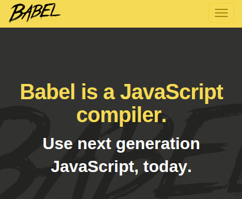

name: inverse
layout: true
class: left, middle, inverse

---
#ECMA Script 6

---


---


---

Dr. Axel Rauschmayer
---

##http://www.2ality.com/

##http://es6-features.org/

##https://babeljs.io/

##https://github.com/buchslava/es6-presentation

---
#Block-scoped binding constructs

---

Both let and const create variables
that are block-scoped – they only exist within
the innermost block that surrounds them.

```js
function func() {
  if (true) {
    let tmp = 123;
  }
  console.log(tmp); // ReferenceError: tmp is not defined
}
```

---

##Block scoping means that you can
##shadow variables within a function:

```js
function func() {
  let foo = 5;
  if (true) {
    let foo = 10; // shadows outer `foo`
    console.log(foo); // 10
  }
  console.log(foo); // 5
}
```

---

##const creates immutable variables
```js
const obj = {};
obj.prop = 123;
console.log(obj.prop); // 123

obj = {}; // TypeError
```
if you wanted obj to
truly be a constant, you’d have to freeze its value:

```js
const obj = Object.freeze({});
obj.prop = 123; // TypeError
```

---

##ES6:

```js
const PI = 3.141593
```

##ES5:

```js
//  only in ES5 through the help of object properties
//  and only in global context and not in a block scope
Object.defineProperty(typeof global === "object" ? global : window, "PI", {
    value:        3.141593,
    enumerable:   true,
    writeable:    false,
    configurable: false
})
```

---

#The temporal dead zone

##A variable declared by let or const has a so-called
##temporal dead zone (TDZ): When entering its scope,
##it can’t be accessed (got or set) until execution
##reaches the declaration.

```js
if (true) { // enter new scope, TDZ starts

  // Uninitialized binding for 'tmp' is created
  tmp = 'abc'; // ReferenceError
  console.log(tmp); // ReferenceError

  let tmp; // TDZ ends, 'tmp' is initialized with `undefined`
  console.log(tmp); // undefined

  tmp = 123;
  console.log(tmp); // 123
}
```

---

##In loops, you get a fresh binding
##for each iteration if you let-declare a variable.
##The loops that allow you to do so are: for, for-in and for-of.

```js
let arr = [];
for (var i = 0; i &lt; 3; i++) {
  arr.push(function() {return i;});
}

console.log(arr.map(function(x){return x();}));

// [3,3,3]

let arr = [];
for (let i = 0; i &lt; 3; i++) {
  arr.push(function() {return i;});
}

console.log(arr.map(function(x){return x();}));

// [0,1,2]
```

---

#Parameters

##Parameters versus local variables

```js
function func(arg) {
  let arg; // static error: duplicate declaration of `arg`
}
```

##Doing the same inside a block shadows the parameter:

```js
function func(arg) {
  {
    let arg; // shadows parameter `arg`
  }
}
```

---
##Parameter default
##values don’t see the scope of the body

```js
let foo = 'outer';
function bar(func = x => foo) {
  let foo = 'inner';
  console.log(func()); // outer
}
bar();
```

---

#Arrows

---
##Arrow Functions
##Expression Bodies
##More expressive closure syntax.

##ES6:

```js
let odds  = evens.map(v => v + 1);
let pairs = evens.map(v => ({ even: v, odd: v + 1 }));
let nums  = evens.map((v, i) => v + i);
```

##ES5:

```js
var odds  = evens.map(function (v) { return v + 1; });
var pairs = evens.map(function (v) { return { even: v, odd: v + 1 }; });
var nums  = evens.map(function (v, i) { return v + i; });
```

---
##ES6:
```js
nums.forEach(v => {
   if (v % 5 === 0)
       fives.push(v);
})
```

##ES5:
```js
nums.forEach(function (v) {
   if (v % 5 === 0)
       fives.push(v);
});
```

---

#Arrow Functions
##Lexical this
##More intuitive handling of current object context.

##ES6:

```js
this.nums.forEach((v) => {
    if (v % 5 === 0)
        this.fives.push(v);
});
```
##ES5:
```js
var self = this;
this.nums.forEach(function (v) {
    if (v % 5 === 0)
        self.fives.push(v);
});
```

---

##ES 5 example with timer
```js
var o = {
  name: 'my name',
  go: function() {
    setTimeout(function() {
      console.log(this.name)
    }, 100)
  }
}

o.go();
// undefined
```

---

##ES 6 example with timer
```js
var o = {
  name: 'my name',
  go: function () {
    setTimeout(() => {
      console.log(this.name)
    }, 100)
  }
}

o.go();

// my name</span>
```

---
#Template Strings
```js
// Basic literal string creation
var s1 = `In ES5 \\n is a line-feed.`;
console.log(s1);
//In ES5
// is a line-feed.

// Multiline strings
var s2 = `In ES5 this is
 not legal.`;
console.log(s2);

//In ES5 this is;
// not legal.

// Interpolate variable bindings
var name = "Bob", time = "today";
var s3 = `Hello ${name}, how are you ${time}?`;
```

---
```js
var s4 = `http://foo.org/bar?a=${a}&b=${b}
    Content-Type: application/json
    X-Credentials: ${credentials}
    { "foo": ${foo},
      "bar": ${bar}}`;
```

---

#Enhanced Object Literals

---
```js
function handler() {
  console.log('from handler');
}

let obj = {
    // Shorthand for ‘handler: handler’
    handler,
    // Methods
    toString() {
     // Super calls
     return "super call " + super.toString();
    },
    // Computed (dynamic) property names
    [ "prop_" + (() => 42)() ]: 42
};
```

---

##Calling of previous code:
```js
setTimeout(function() {
  console.log(obj.toString());
  obj.handler();
  console.log(obj.prop_42);
}, 100);

// super call string
// from handler
// 42
```
---

#Spread operator.
##Callee-evaluated default parameter values.
```js
console.log(...[1,2,3]);

//same as</span>

console.log(1,2,3)
```

---
```js
function f(x, ...y) {
  // y is an Array
  return x * y.length;
}
f(3, "hello", true) == 6

function f(x, y, z) {
  return x + y + z;
}
// Pass each elem of array as argument
f(...[1,2,3]) == 6
```

---
```js
let x = [1, 2];
let y = [3, 4];
x.push(...y);  // x is [1, 2, 3, 4]
```

##Failing to use spread operator:
```js
function f(a,...b, c) {
  console.log(a, b, c);
}

f(1,2,3,4);
```
##Parameter with spread operator
##should be LAST in parameter list
##of function!

---

#Destructuring

---
```js
let obj = { first: 'Jane', last: 'Doe' };
let { first: f, last: l } = obj;
// f = 'Jane'; l = 'Doe'</span>

// Variable declarations:
let [x] = ['a'];
const [x] = ['a'];
var [x] = ['a'];

// Assignments:
[x] = ['a'];

// Parameter definitions:
function f([x]) {
  console.log(x);
}

f(['a']);
// a
```

---
```js
let [x, y] = ['a', 'b'];
// x = 'a'; y = 'b'

let { x: x } = { x: 7, y: 3 };
// x = 7

let [x,y] = ['a', 'b', 'c'];
// x='a'; y='b';

let [x] = [];
// x = undefined
let {prop:y} = {};
// y = undefined

let obj = { a: [{ foo: 123, bar: 'abc' }, {}], b: true };
let { a: [{foo: f}] } = obj;
// f = 123
```

---
##Object patterns coerce values to objects

The object pattern coerces destructuring sources to objects
before accessing properties.
That means that it works with primitive values:

```js
let {length : len} = 'abc';
// len = 3
let {toString: s} = 123;
// s = Number.prototype.toString

Number.prototype.myFun = function(x) {
  return x*x;
};

let {myFun: square} = 0;
console.log(square(7));

// 49
```

---
##Failing to object-destructure a value

---

ToObject() throws a TypeError if it encounters undefined or null.
Therefore, the following destructurings fail,
even before destructuring accesses any properties:
```js
let { prop: x } = undefined; // TypeError
let { prop: y } = null; // TypeError
```

As a consequence, you can use the empty object pattern {} to check
whether a value is coercible to an object.
As we have seen, only undefined and null aren’t:

```js
({}) = undefined; // TypeError
({}) = null; // TypeError
```

---
#Array patterns work with iterables
##Strings are iterable:
```js
let [x,...y] = 'abc'; // x='a'; y=['b', 'c']

let [x,y] = new Set(['a', 'b']); // x='a'; y='b’;

function* allNaturalNumbers() {
  for (let n = 0; ; n++) {
    yield n;
  }
}
let [x, y, z] = allNaturalNumbers(); // x=0; y=1; z=2
```

---
##Failing to array-destructure a value

```js
let x;
[x] = [true, false]; // OK, arrays are iterable
[x] = 'abc'; // OK, strings are iterable
[x] = { * [Symbol.iterator]() { yield 1 } }; // OK, iterable

[x] = {}; // TypeError, empty objects are not iterable
[x] = undefined; // TypeError, not iterable
[x] = null; // TypeError, not iterable

[] = {}; // TypeError, empty objects are not iterable
[] = undefined; // TypeError, not iterable
[] = null; // TypeError, not iterable
```
---
# To be continued...
