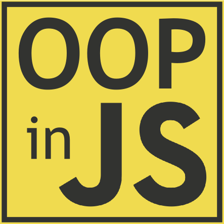
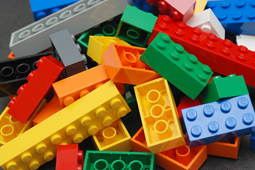

name: inverse
layout: true
class: left, middle, inverse

---
#ECMA Script 6

#Classes

---

---

##Very simple example
```js
class Foo {
  bar(x) {
   this.x = x;
  }
}

let f = new Foo();
Foo.prototype.a = 1;
console.log(f.a, Foo.prototype.bar);

//1 [Function: bar]
```

---
##ES6:
```js
class Shape {
    constructor (id, x, y) {
        this.id = id;
        this.move(x, y);
    }
    move (x, y) {
        this.x = x;
        this.y = y;
    }
}
```
##ES5:
```js
var Shape = function (id, x, y) {
    this.id = id;
    this.move(x, y);
};
Shape.prototype.move = function (x, y) {
    this.x = x;
    this.y = y;
};
```
---
```js
class Point {
  constructor(x, y) {
    this.x = x;
    this.y = y;
  }
  toString() {
    return '(' + this.x + ', ' + this.y + ')';
  }
}

class ColorPoint extends Point {
  constructor(x, y, color) {
    super(x, y);
    this.color = color;
  }
  toString() {
    return super.toString() + ' in ' + this.color;
  }
}

let cp = new ColorPoint(25, 8, 'green');
cp.toString();// '(25, 8) in green'

console.log(cp instanceof ColorPoint); // true
console.log(cp instanceof Point); // true
```

---
##ES6:
```js
class Rectangle extends Shape {
  constructor (id, x, y, width, height) {
    super(id, x, y);
    this.width  = width;
    this.height = height;
  }
}
```
##ES5:
```js
function Rectangle(id, x, y, width, height) {
  Shape.call(this, id, x, y);
  this.width  = width;
  this.height = height;
};
Rectangle.prototype = Object.create(Shape.prototype);
Rectangle.prototype.constructor = Rectangle;
```

---
```js
class Point {
  constructor(x, y) {
    this.x = x;
    this.y = y;
  }
  toString() {
    return '(' + this.x + ', ' + this.y + ')';
  }
}

var p = new Point(25, 8);
p.toString();
//'(25, 8)'</span>
```

In fact, the result of a class definition is a function:

```js
typeof Point;
//'function'
```

However, you can only invoke a class via new,
not via a function call (Sect. 9.2.2 in the spec):

```js
Point();
//TypeError: Classes can’t be function-called<
```

---
#Class declarations are not hoisted

Function declarations are hoisted: When entering a scope,
the functions that are declared in it are immediately
available – independently of where the declarations happen.
That means that you can call a function that is declared later:</span>

```js
foo(); // works, because `foo` is hoisted

function foo() {}
```

---
##In contrast, class declarations are not hoisted.
Therefore, a class only exists after execution reached its definition
and it was evaluated. Accessing it beforehand leads to a ReferenceError:

```js
new Foo(); // ReferenceError

class Foo {}


function functionThatUsesBar() {
  new Bar();
}

functionThatUsesBar(); // ReferenceError
class Bar {}
functionThatUsesBar(); // OK
```

---
#Class expressions

Similarly to functions, there are two kinds of class definitions,
two ways to define a class: class declarations and class expressions.

Also similarly to functions, the identifier of a class expression
is only visible within the expression:

```js
const MyClass = class Me {
  getClassName() {
    return Me.name;
  }
};
let inst = new MyClass();
console.log(inst.getClassName()); // Me
console.log(Me.name); // ReferenceError: Me is not defined
```

---
Inside the body of a class definition
A class body can only contain methods, but not data properties.
Prototypes having data properties is generally considered
an anti-pattern, so this just enforces a best practice.

constructor, static methods, prototype methods

Let’s examine three kinds of methods that you often
find in class literals.

```js
class Foo {
  constructor(prop) {
    this.prop = prop;
  }
  static staticMethod() {
    return 'classy';
  }
  prototypeMethod() {
    return 'prototypical';
  }
}
let foo = new Foo(123);
```

---
First, the pseudo-method constructor. This method is special,
as it defines the function that represents the class:

```js
Foo === Foo.prototype.constructor;
//true

typeof Foo;
//'function'
```

Second, static methods. Static properties (or class properties)
are properties of Foo itself. If you prefix a method definition with static,
you create a class method:

```js
typeof Foo.staticMethod;
//'function'
Foo.staticMethod();
//'classy'
```

Third, prototype methods. The prototype properties of Foo
are the properties of Foo.prototype.
They are usually methods and inherited
by instances of Foo.

```js
typeof Foo.prototype.prototypeMethod;
//'function'

foo.prototypeMethod()
//'prototypical'
```

---
#Static method explanation:

##ES6:
```js
class Rectangle extends Shape {
  …
  static defaultRectangle () {
    return new Rectangle("default", 0, 0, 100, 100)
  }
}
```
##ES5:
```js
function Rectangle(id, x, y, width, height) {
  …
};
Rectangle.defaultRectangle = function () {
  return new Rectangle("default", 0, 0, 100, 100);
};
```

---
#Getters and setters

##The syntax for getters and setters is just like in
##ECMAScript 5 object literals:

```js
class MyClass {
  get prop() {
    return 'getter';
  }
  set prop(value) {
    console.log('setter: '+value);
  }
}

let inst = new MyClass();
inst.prop = 123;
//setter: 123
inst.prop
//'getter'
```

---
#Computed method names

##You can define the name of a method via an expression,
if you put it in square brackets. For example, the following
ways of defining Foo are all equivalent.</span>
```js
class Foo() {
  myMethod() {}
}

class Foo() {
  ['my'+'Method']() {}
}

const m = 'myMethod';
class Foo() {
  [m]() {}
}
```

---
#Subclassing
##The extends clause lets you create a subclass
##of an existing constructor
##(which may or may not have been defined via a class):
```js
class Point {
  constructor(x, y) {
    this.x = x;
    this.y = y;
  }
  toString() {
    return '(' + this.x + ', ' + this.y + ')';
  }
}

class ColorPoint extends Point {
  constructor(x, y, color) {
    super(x, y); // (A)
    this.color = color;
  }
  toString() {
    return super.toString() + ' in ' + this.color; // (B)
  }
}
```

---
Again, this class is used like you’d expect:

```js
let cp = new ColorPoint(25, 8, 'green');
cp.toString();
//'(25, 8) in green'

cp instanceof ColorPoint;
//true
cp instanceof Point;
//true
```

---
##The prototype of a subclass is the superclass

```js
Object.getPrototypeOf(ColorPoint) === Point;
//true
```

---
##That means that static properties are inherited:
```js
class Foo {
  static classMethod() {
    return 'hello';
  }
}

class Bar extends Foo {
}
Bar.classMethod(); // 'hello'
```

##You can even super-call static methods:
```js
class Foo {
  static classMethod() {
    return 'hello';
  }
}

class Bar extends Foo {
  static classMethod() {
    return super.classMethod() + ', too';
  }
}
Bar.classMethod(); // 'hello, too'
```

---
#Super-constructor calls

##In a derived class, you must call super() before you can use this:
```js
class Foo {}

class Bar extends Foo {
  constructor(num) {
    let tmp = num * 2; // OK
    this.num = num; // ReferenceError
    super();
    this.num = num; // OK
  }
}
```

---
##Implicitly leaving a derived constructor
##without calling super() also causes an error:
```js
class Foo {}

class Bar extends Foo {
  constructor() {
  }
}

let bar = new Bar(); // ReferenceError
```

---
##Overriding the result of a constructor
```js
class Foo {
  constructor() {
    return Object.create(null);
  }
}
console.log(new Foo() instanceof Foo); // false
```

---

---

#21+

---
```js
var aggregation = (baseClass, ...mixins) => {
    let base = class _Combined extends baseClass {
        constructor (...args) {
            super(...args);
                mixins.forEach((mixin) => {
                mixin.prototype.initializer.call(this);
            });
        }
    };
    let copyProps = (target, source) => {
        Object.getOwnPropertyNames(source)
            .concat(Object.getOwnPropertySymbols(source))
            .forEach((prop) => {
               let p = /^(?:constructor|prototype|...|apply|toString|length)$/l
               if (prop.match(p)) {
                 return;
               }
               Object.defineProperty(target, prop,
                  Object.getOwnPropertyDescriptor(source, prop))
        })
    }
    mixins.forEach((mixin) => {
        copyProps(base.prototype, mixin.prototype);
        copyProps(base, mixin);
    });
    return base;
};
```

---
```js
class Colored {
    initializer () { this._color = "white"; }
    get color ()   { return this._color; }
    set color (v)  { this._color = v; }
}

class ZCoord {
    initializer () { this._z = 0; }
    get z ()       { return this._z; }
    set z (v)      { this._z = v; }
}

class Shape {
    constructor (x, y) { this._x = x; this._y = y; }
    get x ()           { return this._x; }
    set x (v)          { this._x = v; }
    get y ()           { return this._y; }
    set y (v)          { this._y = v; }
}

class Rectangle extends aggregation(Shape, Colored, ZCoord) {}

var rect = new Rectangle(7, 42);
rect.z     = 1000;
rect.color = "red";
console.log(rect.x, rect.y, rect.z, rect.color);
```
---
# To be continued...
