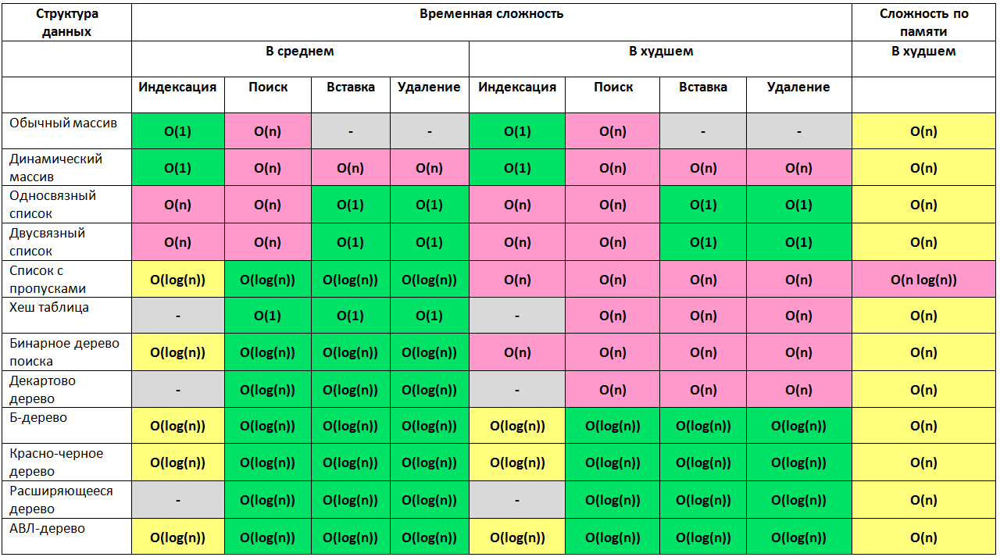

name: inverse
layout: true
class: left, middle, inverse
---
#Maps ans Sets
###Among others, the following four data structures are new in ECMAScript 6: Map, WeakMap, Set and WeakSet.
This part explains how they work.

.footnote[@buchslava]

???

---
#Before... (ES5)

##The Problem with Object Literals

http://ryanmorr.com/true-hash-maps-in-javascript/

```js
var map = {};
'toString' in map; // true

var map = {};
map.hasOwnProperty('toString'); // false

var map = {};
map.hasOwnProperty = 'foo';
map.hasOwnProperty('hasOwnproperty'); // TypeError

var map = {};
var has = {}.hasOwnProperty;

for(var key in map){
    if(has.call(map, key)){
        // do something
    }
}
```

---
#Bare Objects
```js
var map = Object.create(null);

map instanceof Object; // false
Object.prototype.isPrototypeOf(map); // false
Object.getPrototypeOf(map); // null
map + ""; // TypeError: Cannot convert object to primitive value
'toString' in map; // false

Object.defineProperties(map, {
    'foo': {
        value: 1,
        enumerable: true
    },
    'bar': {
        value: 2,
        enumerable: false
    }
});

map.foo; // 1
map['bar']; // 2

JSON.stringify(map); // {"foo":1}
```
---

##Why serarate solutions?


---
#Map. Basic operations
##Working with single entries:

```js
let map = new Map();

map.set('foo', 123);
map.get('foo'); //123

map.has('foo'); //true
map.delete('foo'); //true
map.has('foo'); //false
```

##Determining the size of a map and clearing it:
```js
let map = new Map();
map.set('foo', true);
map.set('bar', false);

map.size; //2
map.clear();
map.size; //0
```
???

---
#Setting up a map
You can set up a map via an iterable over key-value “pairs” (arrays with 2 elements). One possibility is to use an array (which is iterable)

```js
let map = new Map([
  [ 1, 'one' ],
  [ 2, 'two' ],
  [ 3, 'three' ], // trailing comma is ignored
]);
```

Alternatively, the set method is chainable:

```js
let map = new Map()
  .set(1, 'one')
  .set(2, 'two')
  .set(3, 'three');
```

---
#Keys
##Any value can be a key, even an object

```js
let map = new Map();

const KEY1 = {};
map.set(KEY1, 'hello');
console.log(map.get(KEY1)); // hello

const KEY2 = {};
map.set(KEY2, 'world');
console.log(map.get(KEY2)); // world
```

---
#What keys are considered equal?

```js
NaN === NaN; // false

let map = new Map();

map.set(NaN, 123);
map.get(NaN); // 123

map.set(-0, 123);
map.get(+0); // 123

new Map().set({}, 1).set({}, 2).size; // 2

new Map().get('asfddfsasadf'); // undefined
```

---
#Iterating

---

##Iterables for keys and values
```js
let map = new Map([
  [false, 'no'],
  [true,  'yes'],
]);

for (let key of map.keys()) {
  console.log(key);
}
// Output:
// false
// true

for (let value of map.values()) {
  console.log(value);
}
// Output:
// no
// yes
```
---
#Iterables for entries
```js
for (let entry of map.entries()) {
  console.log(entry[0], entry[1]);
}
// Output:
// false no
// true yes

for (let [key, value] of map.entries()) {
  console.log(key, value);
}

for (let [key, value] of map) {
  console.log(key, value);
}
```

---

##Spreading iterables
```js
let arr = [2, 11, -1];
Math.max(...arr); // 11

let map = new Map([
  [1, 'one'],
  [2, 'two'],
  [3, 'three'],
]);
let arr = [...map.keys()]; // [1, 2, 3]
```

---
#Looping over entries

```js
let map = new Map([
  [false, 'no'],
  [true,  'yes'],
]);

map.forEach((value, key) => {
  console.log(key, value);
});
// Output:
// false no
// true yes
```
---
#Mapping and filtering

```js
let map0 = new Map()
  .set(1, 'a')
  .set(2, 'b')
  .set(3, 'c');


let map1 = new Map(
  [...map0] // step 1
  .filter(([k, v]) => k < 3) // step 2
); // step 3

// result of steps 1-2 is :
// [ [ 1, 'a' ], [ 2, 'b' ] ]

// Resulting map: {1 => 'a', 2 => 'b'}


let map2 = new Map(
  [...map0] // step 1
  .map(([k, v]) => [k * 2, '_' + v]) // step 2
); // step 3
// Resulting map: {2 => '_a', 4 => '_b', 6 => '_c'}
```

---
#WeakMap

A WeakMap is a map that doesn’t prevent its keys from being garbage-collected. That means that you can associate data with objects without having to worry about memory leaks.

A WeakMap is a data structure whose keys must be objects and whose values can be arbitrary values. It has the same API as Map, with one significant difference: you can’t iterate over the contents – neither the keys, nor the values, nor the entries. You can’t clear a WeakMap, either.

---
The Antipattern

```js
let o1 = {k: 1};
let o2 = {k: 2};
let o3 = {k: 3};

let m = new Map()
  .set(o1, 'a')
  .set(o2, 'b')
  .set(o3, 'c');

console.log(o2, m.get(o2), m.size);
o2 = null;
console.log(o2, m.get(o2), m.size);

m.forEach((value, key) => {
  console.log(key, value);
});

// { k: 2 } 'b' 3
// null undefined 3
// { k: 1 } 'a'
// { k: 2 } 'b'
// { k: 3 } 'c'


```
---
#Simple example:

```js
let m = new WeakMap();

var o = {
  k1: {},
  k2: {}
}

m.set(o.k1, 'a');
m.set(o.k2, 'b');

console.log(m.get(o.k1), m.get(o.k2));
o.k1 = null;
console.log(m.get(o.k1), m.get(o.k2));

//a b
//undefined 'b'
```

---

WeakMaps have only four methods, all of them work the same as the Map methods.

```js
WeakMap.prototype.get(key) : any
WeakMap.prototype.set(key, value) : this
WeakMap.prototype.has(key) : boolean
WeakMap.prototype.delete(key) : boolean
```

---
#Sets
##Managing single elements:
```js
let set = new Set();
set.add('red');
set.has('red'); // true
set.delete('red'); // true
set.has('red'); // false
```

##Determining the size of a set and clearing it:
```js
let set = new Set();
set.add('red');
set.add('green');
set.size; // 2
set.clear();
set.size; // 0
```
---
#Setting up a set

```js
let set = new Set(['red', 'green', 'blue']);
```

Alternatively, the add method is chainable:

```js
let set = new Set().add('red').add('green').add('blue');
```

---
#Values

Like maps, elements are compared similarly to ===, with the exception of NaN being like any other value.

```js
let set = new Set([NaN]);
set.size; // 1
set.has(NaN); // true
```

##Adding an element a second time has no effect:

```js
let set = new Set();
set.add('foo');
set.size; // 1
set.add('foo');
set.size; // 1
```
---
Similarly to ===, two different objects are never considered equal (which can’t currently be customized, as explained in the FAQ, later):

```js
let set = new Set();

set.add({});
set.size; // 1

set.add({});
set.size; // 2
```

---
#Iterating

```js
let set = new Set(['red', 'green', 'blue']);
for (let x of set) {
    console.log(x);
}
// Output:
// red
// green
// blue

let set = new Set(['red', 'green', 'blue']);
let arr = [...set]; // ['red', 'green', 'blue']

let arr = [3, 5, 2, 2, 5, 5];
let unique = [...new Set(arr)]; // [3, 5, 2]
```

---
#Mapping and filtering

```js
let set = new Set([1, 2, 3]);
set = new Set([...set].map(x => x * 2));
// Resulting set: {2, 4, 6}

let set = new Set([1, 2, 3, 4, 5]);
set = new Set([...set].filter(x => (x % 2) == 0));
// Resulting set: {2, 4}
```

---
#WeakSet

A WeakSet is a set that doesn’t prevent its elements from being garbage-collected. Consult the section on WeakMap for an explanation of why WeakSets don’t allow iteration, looping and clearing.

Given that you can’t iterate over their elements, there are not that many use cases for WeakSets. They enable you to mark objects, to associate them with boolean values.

```js

let s = new WeakSet();
s.add({});
console.log(s.has({}));

var o = {};
s.add(o);
console.log(s.has({}), s.has(o));

o = null;
console.log(s.has({}), s.has(o));

//false
//false true
//false false
```
---
#WeakMap implementation
##Private properties

http://fitzgeraldnick.com/weblog/53/

```js
const privates = new WeakMap();

function Public() {
  const me = {
    // Private data goes here
  };
  privates.set(this, me);
}

Public.prototype.method = function () {
  const me = privates.get(this);
  // Do stuff with private data in `me`...
};

module.exports = Public;
```
