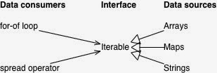

name: inverse
layout: true
class: left, middle, inverse
---
#Iterables and iterators

##Iterability

The idea of iterability is as follows.

Data consumers: JavaScript has language constructs that consume data. For example, for-of loops over values and the spread operator (...) inserts values into arrays or function calls.

Data sources: The data consumers could get their values from a variety of sources. For example, you may want to iterate over the elements of an array, the key-value entries in a map or the characters of a string.



---

Let’s see what consumption looks like for an array arr. First, you create an iterator via the method whose key is Symbol.iterator:

```js
let arr = ['a', 'b', 'c'];
let iter = arr[Symbol.iterator]();
```

Then you call the iterator’s method next() repeatedly to retrieve the items “inside” the array:

```js
iter.next()
// { value: 'a', done: false }
iter.next()
// { value: 'b', done: false }
iter.next()
// { value: 'c', done: false }
iter.next()
// { value: undefined, done: true }
```

---
#Iterable data sources

I’ll use the for-of loop to iterate over various kinds of iterable data.

##Arrays

```js
for (let x of ['a', 'b']) {
  console.log(x);
}
// Output:
// 'a'
// 'b'
```

##Strings

```js
for (let x of 'a\uD83D\uDC0A') {
        console.log(x);
    }
    // Output:
    // 'a'
    // '\uD83D\uDC0A' (crocodile emoji)
```

---
##Maps

```js
let map = new Map().set('a', 1).set('b', 2);
for (let pair of map) {
  console.log(pair);
}
// Output:
// ['a', 1]
// ['b', 2]
```

##Sets

```js
let set = new Set().add('a').add('b');
for (let x of set) {
  console.log(x);
}
// Output:
// 'a'
// 'b'
```

---
##arguments
```js
function printArgs() {
  for (let x of arguments) {
    console.log(x);
  }
}
printArgs('a', 'b');

// Output:
// 'a'
// 'b'
```

##DOM data structures
```js
for (let node of document.querySelectorAll('···')) {
  //···
}
```

---

#Iterable computed data
##Not all iterable content does have to come from data structures, it could also be computed on the fly. For example, all major ES6 data structures (arrays, typed arrays, maps, sets) have three methods that return iterable objects:

entries() returns an iterable over entries encoded as [key,value] arrays. For arrays, the values are the array elements and the keys are their indices. For sets, each key and value are the same – the set element.
keys() returns an iterable over the keys of the entries.
values() returns an iterable over the values of the entries.
Let’s see what that looks like. entries() gives you a nice way to get both array elements and their indices:

```js
let arr = ['a', 'b', 'c'];
for (let pair of arr.entries()) {
  console.log(pair);
}
// Output:
// [0, 'a']
// [1, 'b']
// [2, 'c']
```

---
##Plain objects are not iterable
Plain objects (as created by object literals) are not iterable:

```js
for (let x of {}) { // TypeError
  console.log(x);
}
```

##Solution

```js
let obj = { first: 'Jane', last: 'Doe' };

for (let [key,value] of objectEntries(obj)) {
  console.log(`${key}: ${value}`);
}

// Output:
// first: Jane
// last: Doe
```

---
#Iterating language constructs

##Destructuring via an array pattern

```js
let set = new Set().add('a').add('b').add('c');
let [x,y] = set;
// x='a'; y='b'

let [first, ...rest] = set;
// first='a'; rest=['b','c'];
```

---
##The for-of loop
for-of is a new loop in ECMAScript 6. One form of it looks like this:

```js
for (let x of iterable) {
  //···
}

let arrayLike = { length: 2, 0: 'a', 1: 'b' };

for (let x of arrayLike) { // TypeError
  console.log(x);
}

for (let x of Array.from(arrayLike)) { // OK
  console.log(x);
}
```

---

##Iteration variables: let declarations vs. var declarations

### with 'let'
```js
let arr = [];
for (let elem of [0, 1, 2]) {
  arr.push(() => elem); // save `elem` for later
}
console.log(arr.map(f => f())); // [0, 1, 2]

// `elem` only exists inside the loop:
console.log(elem); // ReferenceError: elem is not defined
```

### with 'var'
```js
let arr = [];
for (var elem of [0, 1, 2]) {
  arr.push(() => elem);
}
console.log(arr.map(f => f())); // [2, 2, 2]

// `elem` exists in the surrounding function:
console.log(elem); // 2
```

---
#Iterating with existing variables, object properties and array elements

```js
let x;
for (x of ['a', 'b']) {
  console.log(x);
}

let obj = {};
for (obj.prop of ['a', 'b']) {
  console.log(obj.prop);
}

let arr = [];
for (arr[0] of ['a', 'b']) {
  console.log(arr[0]);
}

// a
// b
// in all cases...
```
---

##Implementing iterables

```js
let iterable = {
  [Symbol.iterator]() {
    let step = 0;
    let iterator = {
      next() {
        if (step <= 2) {
          step++;
        }
        switch (step) {
          case 1:
            return { value: 'hello', done: false };
          case 2:
            return { value: 'world', done: false };
          default:
            return { value: undefined, done: true };
        }
      }
    };
    return iterator;
  }
};

for (let x of iterable) {
  console.log(x);
}
// Output:
// hello
// world
```
---

Let’s look at one more implementation of an iterable.
The function iterateOver() returns an iterable over the
arguments that are passed to it:

```js
function iterateOver(...args) {
  let index = 0;
  let iterable = {
    [Symbol.iterator]() {
      let iterator = {
        next() {
          if (index < args.length) {
            return { value: args[index++] };
          } else {
            return { done: true };
          }
        }
      };
      return iterator;
    }
  }
  return iterable;
}

// Using `iterateOver()`:
for (let x of iterateOver('fee', 'fi', 'fo', 'fum')) {
  console.log(x);
}

// Output:
// fee
// fi
// fo
// fum
```

---

Iterators that are iterable
The previous function can be simplified if the iterable and the iterator are the same object:

```js
function iterateOver(...args) {
  let index = 0;
  let iterable = {
    [Symbol.iterator]() {
      return this;
    },
    next() {
      if (index < args.length) {
        return { value: args[index++] };
      } else {
        return { done: true };
      }
    },
  };
  return iterable;
}
```

---
Why is it useful if an iterator is also an iterable? for-of only works for iterables, not for iterators. Because array iterators are iterable, you can continue an iteration in another loop:

```js
let arr = ['a', 'b'];
let iterator = arr[Symbol.iterator]();

for (let x of iterator) {
  console.log(x); // a
  break;
}

// Continue with same iterator:
for (let x of iterator) {
  console.log(x); // b
}
```

---

An alternative is to use a method that returns an iterable. For example, the result of Array.prototype.values() iterates the same way as the default iteration. Therefore, the previous code snippet is equivalent to:

```js
let arr = ['a', 'b'];
let iterable = arr.values();
for (let x of iterable) {
  console.log(x); // a
  break;
}
for (let x of iterable) {
  console.log(x); // b
}
```

But with an iterable, you can’t be sure that it won’t restart iteration if for-of calls the method [Symbol.iterator](). For example, instances of Array are iterables that start at the beginning whenever you call this method.

One use case for continuing an iteration is that you can remove initial items (e.g. a header) before processing the actual content via for-of.

---
##Tool functions that return iterables
```js
function objectEntries(obj) {
  let index = 0;

  // In ES6, you can use strings or symbols as property keys,
  // Reflect.ownKeys() retrieves both
  let propKeys = Reflect.ownKeys(obj);

  return {
    [Symbol.iterator]() {
      return this;
    },
    next() {
      if (index < propKeys.length) {
        let key = propKeys[index];
        index++;
        return { value: [key, obj[key]] };
      } else {
        return { done: true };
      }
    }
  };
}

let obj = { first: 'Jane', last: 'Doe' };
for (let [key,value] of objectEntries(obj)) {
  console.log(`${key}: ${value}`);
}

// Output:
// first: Jane
// last: Doe
```

---

##Combinators for iterables

```js
function take(n, iterable) {
  let iter = iterable[Symbol.iterator]();
  return {
    [Symbol.iterator]() {
      return this;
    },
    next() {
      if (n > 0) {
        n--;
        return iter.next();
      } else {
        return { done: true };
      }
    }
  };
}
let arr = ['a', 'b', 'c', 'd'];
for (let x of take(2, arr)) {
  console.log(x);
}
// Output:
// a
// b
```

---
##Infinite iterables

Some iterable may never be done.
```js
function naturalNumbers() {
  let n = 0;
  return {
    [Symbol.iterator]() {
      return this;
    },
    next() {
      return { value: n++ };
    }
  }
}
```

With an infinite iterable, you must not iterate over “all” of it.
For example, by breaking from a for-of loop:

```js
for (let x of naturalNumbers()) {
  if (x > 2) break;
    console.log(x);
}
```

---
Or by only accessing the beginning of an infinite iterable:

```js
let [a, b, c] = naturalNumbers();
// a=0; b=1; c=2;
```

Or by using a combinator. take() is one possibility:
```js
for (let x of take(3, naturalNumbers())) {
  console.log(x);
}
// Output:
// 0
// 1
// 2
```
---
# To be continued...
